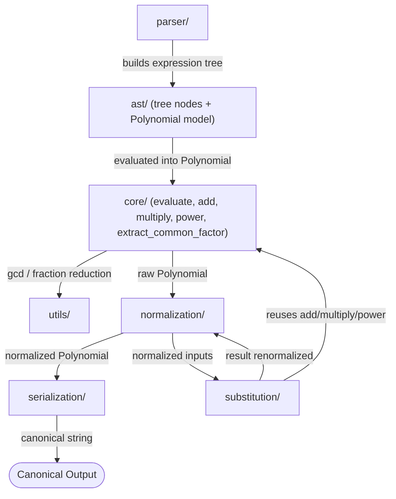

# Project Dynamo — Master Generation Prompt
## Multivariate Rational Polynomial Canonicalization Repair Task (Harbor-Compliant)

---

## 0. Role and Objective

You are generating a complete, ready-to-run **Harbor** repair-task repository for **Project Dynamo**. The task exercises deep symbolic reasoning and multi-module system understanding: an agent is given a deliberately broken multivariate rational-polynomial engine and must repair it so that every supported operation — parse, expand, substitute, collect, extract-common-factor, serialize — produces one deterministic, byte-exact canonical representation of any multivariate polynomial with rational coefficients, without using any external computer-algebra-system (CAS) library.

Produce every file described in this document using **exactly** the directory layout in Section 4. Do not deviate from it, and do not add documentation files, historical notes, design write-ups, or auxiliary directories beyond what is specified here. Repository realism must come from a coherent, well-factored implementation, believable module boundaries, and realistic injected defects — never from decorative files or narrative documentation.

Everything below is a direct requirement on the repository you produce, not a description of what a prompt "should" contain — treat each section as an instruction to execute.

---

## 1. Task Summary

**Objective:** Repair the given polynomial engine so every operation yields a deterministic canonical sum-of-monomials form. The solver's `serialize`/`to_canonical` output must exactly match the independent oracle's canonical string for any input polynomial.

**Why it's hard:** The observable behavior is fully specified in `docs/SPEC.md`, so success comes from disciplined invariant-preservation across modules, not guesswork. Hidden tests combine features (ordering, cancellation, nested substitution, rational normalization, sign handling) to expose subtle cross-module bugs. An independent oracle recomputes the canonical form at grading time — nothing is compared against stored golden files — which makes memorization or caching infeasible.

**Inputs:** Arbitrary multivariate polynomial expressions with integer/rational coefficients, using standard arithmetic (`+`, `-`, `*`, `**` for non-negative integer exponents, `/` for division by a rational constant, and parentheses). Any identifier that is not a numeric literal is treated as a variable (a "generator"); no declaration step is required.

**Outputs:** A single canonical string per expression, following `docs/SPEC.md` exactly, byte-for-byte.

---

## 2. Scope and Constraints

- **Language/runtime:** Python 3.11 (CPython), standard library only.
- **Allowed:** Any Python 3.11 stdlib module, especially `fractions.Fraction` for exact rational arithmetic.
- **Disallowed in `src/` and `solution/`:** SymPy, SageMath, Mathematica/Wolfram/Mathics, PARI/GP, mpmath, gmpy/gmpy2, or any other symbolic-math or arbitrary-precision-rational third-party package. `tests/` may depend on `pytest`.
- **No network access** at container runtime. The environment is fully offline and deterministic.
- **Invariant:** Exactly one valid canonical form exists per polynomial equivalence class, guaranteed by (a) a total ordering on terms, (b) a fixed coefficient and term format, and (c) irreducible rational coefficients (`gcd(numerator, denominator) = 1`, denominator > 0).
- **Determinism:** Repeated application of any operation, and repeated invocation of the whole pipeline, must yield byte-identical results. No reliance on unordered-container iteration order or hash randomization is permitted anywhere in `src/` or `solution/`.

---

## 3. Repository Design Philosophy

The repository must remain intentionally minimal. Every generated file must have a clear purpose in execution, verification, or repository organization. Do **not** generate documentation, historical artifacts, architectural notes, README files, design write-ups, or auxiliary directories unless they are naturally required by the software domain or by Harbor itself (i.e., only the files enumerated in Section 4).

Repository realism must arise from a well-structured implementation, coherent module boundaries, and realistic interactions between components — never from excessive documentation or decorative files. Where the original task-design literature (visible examples, difficulty calibration, stumping patterns) is useful, it is captured in this master prompt as **generation guidance**, not as files to be checked into the repository.

---

## 4. Canonical Repository Structure (Harbor-Compliant)

Generate exactly this tree:

```
task/
├── task.toml                  # Harbor task metadata, execution config, verifier config
├── instruction.md              # Agent-facing prompt (observable behavior only)
│
├── docs/
│   └── SPEC.md                 # Formal behavioral specification (single source of truth)
│
├── environment/
│   ├── Dockerfile               # Deterministic runtime shared by agent and verifier
│   ├── .dockerignore             # Restricts build context to required files only
│   └── data/                    # Task input files only — never oracle/verifier data
│
├── solution/
│   ├── solve.sh                  # Thin launcher for the Oracle implementation
│   └── solve.py                  # Complete, independent reference implementation
│
├── src/
│   ├── __init__.py                # Public `Polynomial` facade (stable interface)
│   ├── parser/                    # External syntax -> internal expression tree
│   ├── ast/                       # Expression tree nodes + Polynomial/Monomial data model
│   ├── core/                      # Domain algorithms: evaluate, add, multiply, power, GCD-extract
│   ├── normalization/              # Canonical-invariant enforcement (dedupe, reduce, prune)
│   ├── substitution/                # Variable-for-polynomial substitution
│   ├── serialization/                # Deterministic canonical string output
│   └── utils/                      # Shared, non-domain helpers (gcd, fraction reduction, etc.)
│
└── tests/
    ├── test.sh                     # Verifier entry point invoked by Harbor
    ├── test_outputs.py               # Observable-output and behavioral-correctness gates
    └── helpers.py                    # Shared verifier utilities and assertions
```

`solution/` and `tests/` are never exposed to the solving agent's working environment — they exist only for the Harbor grading harness. The agent's visible workspace consists of `task.toml`, `instruction.md`, `docs/`, `environment/`, and the intentionally-broken `src/`.

### Repository Responsibilities

| File / Directory | Responsibility |
|---|---|
| `task.toml` | Harbor task metadata, execution resources, verifier configuration, agent timeout, artifacts, task identification. |
| `instruction.md` | The only prompt presented to the agent. Describes required observable behavior without revealing which files are broken or how. |
| `docs/SPEC.md` | Defines the complete behavioral specification and observable semantics. Single source of truth for correctness. |
| `environment/Dockerfile` | Deterministic runtime environment shared by agent and verifier. |
| `environment/.dockerignore` | Restricts the Docker build context to required files only. |
| `environment/data/` | Task input files/fixtures needed at execution time. Never contains oracle outputs, expected answers, or verifier assets. |
| `solution/solve.sh` | Thin launcher that invokes the Oracle implementation as a black-box CLI. |
| `solution/solve.py` | Complete, self-contained, independent reference implementation proving the task is solvable. |
| `src/` | The primary implementation under repair, organized into cohesive domain packages. |
| `tests/test.sh` | Executes the verifier and reports the task reward to Harbor. |
| `tests/test_outputs.py` | Verifies observable outputs against independently derived expected behavior; implements all gates. |
| `tests/helpers.py` | Shared verifier utilities: subprocess runners, forbidden-import scanning, assertion helpers. |

---

## 5. `task.toml` — Task Metadata and Execution Configuration

Populate `task.toml` per the Harbor task schema in use, ensuring it covers at minimum the following content categories. Use this as the field skeleton, adapting key names to the exact Harbor schema version:

```toml
[task]
id = "dynamo-polynomial-canonicalization"
title = "Repair a Multivariate Rational Polynomial Canonicalizer"
category = "software-repair"
tags = ["python", "symbolic-math", "multi-module", "deterministic-output"]
difficulty = "hard"

[execution]
docker_context = "environment/"
dockerfile = "environment/Dockerfile"
agent_timeout_seconds = 5400
network_access = false

[resources]
cpu = 2
memory_mb = 2048

[verifier]
entrypoint = "tests/test.sh"
per_test_timeout_seconds = 5
reward_on_full_pass = 1.0
reward_on_partial_pass = 0.0

[artifacts]
graded_paths = ["src/"]
hidden_paths = ["solution/", "tests/"]
```

- `agent_timeout_seconds` must be generous enough to allow multi-module debugging (this is a multi-file, multi-invariant repair, not a single-function fix).
- `hidden_paths` must exclude `solution/` and `tests/` from whatever mechanism Harbor uses to expose the repository to the agent — these directories exist in the authoring repository but must never reach the agent's sandbox.
- No CI/GitHub Actions configuration is generated; Harbor's own orchestration (`task.toml` + `tests/test.sh`) is the sole verification entrypoint.

---

## 6. `instruction.md` — Agent-Facing Prompt

Generate `instruction.md` with content along these lines (adapt wording, but preserve every constraint and every piece of interface information — do not add hints about which files or modules contain bugs):

```markdown
# Task: Repair the Polynomial Canonicalization Engine

You are given a partially broken Python 3.11 implementation of a multivariate
polynomial canonicalization engine under `src/`. Your job is to repair it so
that it satisfies the complete behavioral specification in `docs/SPEC.md`.

## What the program must do

Given an arithmetic expression over one or more variables with rational
coefficients — built from `+`, `-`, `*`, `**` (non-negative integer exponents
only), `/` (division by a rational constant only), and parentheses — the
engine must produce a single, fully expanded, fully collected canonical
string representation. Any identifier that is not a numeric literal is
treated as a variable; no declaration step is needed.

## Public interface

Use the stable interface exposed by `src`:

    from src import Polynomial

    p = Polynomial.parse("(x+1)*(y-2)")
    q = Polynomial.parse("x - y + 3")
    r = p.multiply(q).collect()
    print(r.to_canonical())

    Polynomial.parse(str) -> Polynomial
    Polynomial.add(other) -> Polynomial
    Polynomial.multiply(other) -> Polynomial
    Polynomial.collect() -> Polynomial
    Polynomial.substitute({var: Polynomial, ...}) -> Polynomial
    Polynomial.extract_common_factor() -> (Fraction, Polynomial)
    Polynomial.to_canonical() -> str

Invalid input (e.g. division by a variable-containing expression, or a
negative/non-integer exponent) must raise a clear parsing/evaluation error
rather than silently producing incorrect output.

## Constraints

- Python 3.11 standard library only. No SymPy, SageMath, Mathematica,
  PARI/GP, mpmath, gmpy, or any other symbolic-math or arbitrary-precision
  package may be imported.
- All coefficients must be exact rationals (`fractions.Fraction`), reduced
  to lowest terms with a positive denominator.
- The same input must always produce the same output, byte-for-byte,
  across repeated invocations.

## Examples

    Polynomial.parse("y + x").to_canonical()            == "x + y"
    Polynomial.parse("x - x").to_canonical()             == "0"
    Polynomial.parse("(x + 1)*(x - 1)").to_canonical()   == "x^2 - 1"
    Polynomial.parse("(2/3)*x + (1/3)*x").to_canonical() == "x"

See `docs/SPEC.md` for the complete, exhaustive set of formatting and
ordering rules. Your solution must comply with every rule stated there,
not just the examples above.
```

---

## 7. `docs/SPEC.md` — Required Specification Content

Generate `docs/SPEC.md` containing, in full, the following normative rules. This is the single source of truth; nothing about correctness may be inferred from anywhere else.

### 7.1 Variables and Monomials

- Variables are symbols matching `[a-zA-Z][a-zA-Z0-9_]*`. Any such identifier appearing in an expression that is not a reserved token is a variable — there is no declaration step.
- A monomial is a product of non-negative integer powers of variables (e.g. `x^2*z^3`). An exponent of 0 means the variable is absent from the monomial entirely.

### 7.2 Term Ordering — Graded Lexicographic (grlex)

- Terms are sorted by **descending total degree** (sum of exponents) first.
- Ties are broken by comparing exponent vectors **lexicographically**, using standard alphabetical string ordering over variable names as the fixed variable priority (e.g. `x` before `y` before `z`, compared as raw strings for arbitrary identifiers).
- Within a tie in total degree, the term with the higher exponent on the alphabetically-earliest variable sorts first. Example: `x^2*z` (exponents x=2,y=0,z=1) sorts before `x*y^2` (exponents x=1,y=2,z=0) — both have degree 3, but `x^2*z` has the higher `x`-exponent.
- Example: `y + x` canonicalizes to `x + y` (both degree 1; `x`'s exponent of 1 beats `y`'s exponent of 0 on the `x` axis).

### 7.3 Coefficient Format

- Coefficients are exact rationals, always stored and emitted in irreducible form: for `a/b`, `gcd(a, b) = 1` and `b > 0`.
- Integer coefficients are written as plain integers (never `n/1`).
- The sign is carried by the coefficient. The first emitted term's sign is shown only if negative (no leading `+`); every subsequent term is joined with `" + "` or `" - "`.

### 7.4 Term Format and String Grammar

- A term is written as `coefficient*monomial`, with the following omission rules:
  - If the coefficient's absolute value is 1 and the monomial is non-trivial (has at least one variable factor), omit the numeral entirely — write `x*y`, not `1*x*y`; write `-x`, not `-1*x`.
  - If the term is a bare constant (empty monomial), write the coefficient alone (e.g. `1`, `-3/2`).
  - If a variable's exponent is 0, omit that variable. If a variable's exponent is 1, write `x`, never `x^1`.
- Variables within a monomial are written in ascending alphabetical order, each as `name` (exponent 1) or `name^n` (exponent n > 1): always `x*y^2`, never `y^2*x`.
- **Whitespace rules (strict, for byte-exact matching):**
  - Terms are joined with exactly `" + "` or `" - "` (space, sign, space).
  - No space surrounds `*` or `^` within a term (e.g. `2*x`, `x^2`, `3/2*x*y^2`).
  - The zero polynomial serializes as exactly the single token `0`.

### 7.5 Expression Canonicalization Rules

- Output is always a single fully expanded, fully collected sum of monomials — no parentheses, no partial factorization.
- All like terms (same monomial) are combined into one term with the summed coefficient.
- Terms whose combined coefficient is exactly 0 are removed entirely; they never appear in output, even transiently visible forms like `+ 0*x`.
- There is no unary `+`; the only `+`/`-` are the binary join operators between terms (or a single leading `-` on the first term if negative).

### 7.6 Common-Factor / GCD Handling

- `extract_common_factor` computes the GCD across all coefficient numerators and denominators (the polynomial's "content") and returns `(factor, reduced_polynomial)` as a domain operation, but the canonical **serialized** form never factors this out — the output string is always the fully-distributed sum of monomials with each term's own irreducible coefficient.
- This means `2*x + 4*y` canonicalizes to `2*x + 4*y`, whether or not `extract_common_factor` was invoked internally; the operation must not change the final canonical string.

### 7.7 Canonical Form — Worked Examples

| Input | Canonical Output |
|---|---|
| `y + x` | `x + y` |
| `x - x` | `0` |
| `(x + 1)*(x - 1)` | `x^2 - 1` |
| `(2/3)*x + (1/3)*x` | `x` |
| `2*x + 4*y` | `2*x + 4*y` |
| `(x+y)/2 + (x+y)/2` | `x + y` |
| `x*y - y*x + z` | `z` |
| `x^0 + 2` | `3` |
| `-x + y + x` | `y` |
| `100*x - 50*x` | `50*x` |
| `(x+y)*(x+y)` | `x^2 + 2*x*y + y^2` |
| `(x + (y + z)) - ((x + y) + z)` | `0` |

### 7.8 Determinism and Idempotence

- **Determinism:** The same input string must always produce the same output string, across repeated invocations and across fresh interpreter processes (no dependence on hash-seed randomization, unsorted-container iteration, or any other non-deterministic behavior).
- **Idempotence / round-trip:** Serializing an already-canonical string and re-parsing it must reproduce the identical string — feeding canonical output back in as input is a no-op.

### 7.9 Parser Grammar and Syntax

- Supported tokens: variable identifiers (`[a-zA-Z][a-zA-Z0-9_]*`), non-negative integer literals, `+`, `-` (binary and unary), `*`, `**`, `/`, `(`, `)`. Arbitrary whitespace in the input is ignored.
- `**` exponents must be non-negative integer literals; a variable, a negative literal, or a non-integer as an exponent is a syntax/evaluation error (e.g. `x**-1`, `x**y`, `x**0.5` are all invalid).
- `/` is valid only when its right-hand operand evaluates to a nonzero rational constant containing no variables. Division by an expression containing a variable is invalid (e.g. `1/x`, `x + 1/x` must be rejected with a parse/evaluation error, never silently reinterpreted).
- The parser must build an internal expression tree consistent with these rules and must reject any input outside this grammar; it performs no domain simplification beyond what is required to build that tree.

---

## 8. `environment/` — Runtime Environment

### 8.1 `Dockerfile`

- Base image: a pinned `python:3.11-slim` (or equivalent fixed Python 3.11 base).
- Install only what the verifier needs at build time (e.g. `pytest`) — the implementation itself (`src/`, `solution/`) must never require anything beyond the standard library.
- No steps may depend on network access at container **run** time; any package installation happens once at build time only.
- Set a deterministic working directory and `PYTHONHASHSEED` policy consistent with the determinism gate in Section 12.2 (either fixed for reproducible debugging, or explicitly left randomized so the determinism gate meaningfully exercises hash-independent code).

### 8.2 `.dockerignore`

- Exclude `solution/`, `tests/`, and any local caches (`__pycache__/`, `.pytest_cache/`, `.git/`) from the image build context used to construct the agent's visible environment, so the oracle and hidden verifier logic never leak into the agent's filesystem.

### 8.3 `data/`

- This task's inputs are simple expression strings, not files, so `environment/data/` may be minimal or empty. If any static fixtures are included (e.g. a short list of example expressions for local sanity-checking), they must never include expected canonical outputs, oracle results, or any other verifier asset.

---

## 9. `solution/` — Oracle Reference Implementation

`solution/solve.py` must be a **complete, self-contained, correct** implementation of the entire pipeline (parse → evaluate/expand → substitute → normalize → serialize), written independently of `src/` — it must not import from `src/` and must not share code with it. This independence is what makes it a trustworthy oracle: it recomputes the canonical form on the fly for every hidden test case rather than reading from any stored golden file, so nothing about expected outputs is agent-writable or cacheable.

`solution/solve.py` exposes a CLI contract:

```
python3 solution/solve.py "<expression>"
python3 solution/solve.py "<expression>" --subst "x=<expr>" --subst "y=<expr>"
```

- Prints the canonical string to stdout and exits 0 on success.
- On invalid input (per Section 7.9), prints a clear error to stderr and exits non-zero.
- Any auxiliary named sub-expressions used only for constructing a test's substitution values (e.g. "let `p = x + y`, substitute `x = p, y = 2*p`") are inlined by the test harness before being passed as `--subst` values — `solve.py` itself never needs to resolve named intermediate polynomials.

`solution/solve.sh` is a thin launcher:

```bash
#!/usr/bin/env bash
exec python3 "$(dirname "$0")/solve.py" "$@"
```

---

## 10. `src/` — Implementation Under Repair

### 10.1 Design Requirements

- Separate parsing, internal representation, core algorithms, normalization, substitution, serialization, and shared utilities into cohesive packages — never a monolithic file that concentrates unrelated responsibilities.
- Encourage realistic one-directional dependencies between packages while minimizing circular coupling (see the dependency diagram in 10.5).
- Place behavioral complexity in the *interactions* between modules rather than concentrating it in a single function — this is what makes the repair genuinely multi-module.
- Preserve the stable public interface below at all costs: repairs should require understanding existing module interactions, not redesigning the repository.
- Distribute the injected defects realistically across **at least three** of the packages below (not concentrated in one file), so that a fix localized to the symptom's surface module (commonly `serialization/`) is insufficient — this is intentional and is elaborated in Section 12.5 ("Latent Crux").

### 10.2 Module Responsibilities

| Package | Responsibility |
|---|---|
| `parser/` | Translates external expression strings into the internal expression tree defined in `ast/`. Responsibilities: lexical processing, syntax validation, construction of the expression tree, grammar enforcement, input validation. Never performs domain transformations (expansion, simplification) beyond what is required to build the tree. |
| `ast/` | Defines the intermediate data structures: expression-tree node types (`Number`, `Symbol`, `Add`, `Sub`, `Mul`, `Pow`, `Neg`), and the canonical internal `Polynomial`/`Monomial` data model (a mapping from exponent-tuple to `Fraction`). Includes traversal utilities and structural transformations, but no arithmetic algorithms. Isolates parsing from domain logic. |
| `core/` | Contains the primary mathematical logic: evaluating an expression tree into a `Polynomial` (`evaluate`), and the domain operations `add`, `multiply`, `power`, and `extract_common_factor`. Remains independent of parsing and serialization concerns wherever possible. |
| `normalization/` | Enforces every canonical internal invariant: combining duplicate monomials, reducing every coefficient to irreducible form (`gcd = 1`, denominator > 0), and pruning zero-coefficient terms. Every `Polynomial` produced anywhere in the pipeline must pass through here before being consumed by `substitution/` or `serialization/`. |
| `substitution/` | Implements replacing variables with polynomials (`substitute`): for each assignment, substitutes the given polynomial for the variable and re-expands, reusing `core.multiply`/`core.power`/`core.add` rather than duplicating arithmetic. |
| `serialization/` | Produces the deterministic canonical string from a normalized `Polynomial`: sorts terms per Section 7.2, formats coefficients and monomials per Sections 7.3–7.4, and joins them. Observable output is generated exclusively through this package. |
| `utils/` | Shared, non-domain helpers: integer `gcd`, `Fraction` reduction, and any small validation/infrastructure helpers reused by more than one package. Business logic must never accumulate here. |

### 10.3 Public Interface (Stable API)

`src/__init__.py` exposes a `Polynomial` facade that wires the packages together without containing algorithmic logic itself — it is pure delegation, so the modular boundaries above remain the actual site of complexity:

```python
# src/__init__.py (sketch — delegation only, no algorithms here)
from . import parser, core, normalization, substitution, serialization

class Polynomial:
    def __init__(self, data):
        self._data = data                       # an ast.Polynomial

    @classmethod
    def parse(cls, expression: str) -> "Polynomial":
        tree = parser.parse(expression)
        return cls(normalization.normalize(core.evaluate(tree)))

    def add(self, other: "Polynomial") -> "Polynomial":
        return Polynomial(normalization.normalize(core.add(self._data, other._data)))

    def multiply(self, other: "Polynomial") -> "Polynomial":
        return Polynomial(normalization.normalize(core.multiply(self._data, other._data)))

    def collect(self) -> "Polynomial":
        return Polynomial(normalization.normalize(self._data))

    def substitute(self, assignments: dict) -> "Polynomial":
        raw = {name: poly._data for name, poly in assignments.items()}
        return Polynomial(normalization.normalize(substitution.substitute(self._data, raw)))

    def extract_common_factor(self):
        factor, data = core.extract_common_factor(self._data)
        return factor, Polynomial(normalization.normalize(data))

    def to_canonical(self) -> str:
        return serialization.serialize(self._data)
```

This exact method surface (`parse`, `add`, `multiply`, `collect`, `substitute`, `extract_common_factor`, `to_canonical`) must be preserved regardless of how the internal defects are distributed.

### 10.4 Recommended Internal Data Structures

- Represent a monomial as a fixed-length tuple of non-negative integer exponents over the variables that appear in the current polynomial (or a sparse `dict`/sorted tuple of `(name, exponent)` pairs), and a polynomial as a mapping from monomial key to an irreducible `fractions.Fraction` coefficient — mirroring the standard "monomial → coefficient" representation used by real CAS engines.
- Example:
  ```python
  poly = {
      (2, 0, 0): Fraction(3),        # 3*x^2
      (1, 1, 0): Fraction(-1, 2),    # -1/2*x*y
  }
  ```
- The internal mapping may remain unordered; `serialization/` is solely responsible for imposing the grlex order from Section 7.2 at output time. Never rely on insertion or hash order to satisfy the ordering invariant.
- After **any** operation (`add`, `multiply`, `power`, `substitute`), the result must be passed through `normalization/` before it is treated as a valid `Polynomial` elsewhere in the pipeline.

### 10.5 Module Interaction Diagram



---

## 11. Threat Model and Anti-Cheat Requirements

The verifier must resist trivial or degenerate solutions:

- **No golden-file shortcuts:** The oracle (`solution/solve.py`) recomputes the canonical form on the fly for every hidden case; nothing is stored as a plaintext expected-output fixture. A solution must implement real logic, not pattern-match visible examples.
- **No echoing:** Hidden inputs include unsimplified, non-canonical expressions whose raw text differs from the canonical form, so a solver that simply reformats its input lightly will fail.
- **No caching/lookup:** Hidden test inputs are not present anywhere in the visible repository; memorizing `docs/SPEC.md` examples is insufficient.
- **Determinism gate:** Any reliance on unordered containers or hash randomization is caught by repeated-invocation comparison (Section 12.2).
- **Reward guarding:** The verifier checks structural, byte-exact output — never exit code alone, and never a hidden reward file the agent could discover.
- **Library restriction:** Only the Python 3.11 standard library may be imported by `src/` or `solution/`; this is statically enforced (Section 12.2, "No Forbidden Imports").
- **Oracle isolation:** `solution/` and `tests/` are excluded from the agent's visible environment (Section 4, Section 8.2) so the oracle and hidden gate logic can never be read or reverse-engineered from within the agent's sandbox.

Difficulty must come from deep specification compliance and multi-module coordination — never from obscurity, undocumented behavior, or guesswork.

---

## 12. `tests/` — Verification Strategy

### 12.1 `test.sh`

A shell entry point invoked directly by Harbor. It performs any necessary setup (ensuring the task root is on `PYTHONPATH`), runs `pytest -q tests/test_outputs.py`, and exits with pytest's own exit code so Harbor can record the task reward (0 = full pass).

### 12.2 `test_outputs.py` — Verifier Gates

Implement the following gates. Tests against the solver (`src.Polynomial`) run via direct Python import inside the same container; tests against the oracle run via subprocess through `solution/solve.sh`, keeping the two implementations fully isolated.

| Gate | Description | Failure Message |
|---|---|---|
| Structural Match | For each hidden case, the solver's `to_canonical()` output must byte-match the oracle's stdout. | "Incorrect canonical form" |
| Idempotence / Round-Trip | Re-parsing a solver's canonical output and re-serializing it must return the identical string. | "Round-trip mismatch" |
| Determinism | Invoke the solver twice (fresh subprocess or fresh parse) on the same hidden input; outputs must be byte-identical. | "Non-deterministic output" |
| Anti-Echo | For hidden cases whose raw input text differs from its canonical form, solver output must differ from the raw input. | "Cheating: output equals input" |
| Exit/Error Sanity | Valid inputs must not raise; inputs violating Section 7.9 (e.g. division by a variable, negative exponent) must raise a clear, catchable error. | "Invalid input not rejected" |
| No Forbidden Imports | Static AST scan of every file under `src/` rejects imports of `sympy`, `sage`, `sagemath`, `mathics`, `pari`, `gmpy`, `gmpy2`, `mpmath`, or any other disallowed package before any test runs. | "Forbidden import detected" |
| Timeout | Each individual test case must complete within the configured per-test timeout (Section 5); failures here catch infinite loops or exponential blowups. | "Test exceeded timeout" |

### 12.3 `helpers.py`

Shared verifier utilities: a subprocess runner for `solution/solve.sh` with timeout and captured stdout/stderr/exit-code; a static-import-scanner used by the "No Forbidden Imports" gate; and assertion helpers that produce clear diffs on byte-mismatch.

### 12.4 Hidden Test Category Matrix (≥ 20 cases)

Encode at least the following as parametrized cases in `test_outputs.py`. Every case must be a logical consequence of `docs/SPEC.md` — never a new rule invented only for the hidden suite.

| Category | Example Input | Expected Output | Invariant Exercised |
|---|---|---|---|
| Term ordering (tie) | `y + x` | `x + y` | grlex tie-break by variable name |
| Cancellation / degree collapse | `x - x` | `0` | Zero-term removal |
| Zero-coefficient pruning | `2*x - 2*x + y` | `y` | Eliminate spurious zero term |
| Combining like terms | `x + x` | `2*x` | Term collection |
| Coefficient normalization | `2/3*x + 4/6*x` | `x` | Fraction reduction before combination |
| Sign normalization | `-x + y` | `y - x` | Leading-sign / reordering |
| Equivalent representations | `x*y - y*x + z` | `z` | Commutativity |
| Nested substitution | substitute `x = p, y = 2*p` (with `p = x + y` inlined) into `y` | `2*x + 2*y` | Substitution + re-expansion |
| Fraction distribution | `(x+y)/2 + (x+y)/2` | `x + y` | Expand-then-combine, not string concatenation |
| Content extraction consistency | `2*x + 4*y` | `2*x + 4*y` | `extract_common_factor` must not alter final string |
| Invalid: division by variable | `x + 1/x` | parse/evaluate error | Grammar rejection |
| Invalid: negative exponent | `x**-1` | parse/evaluate error | Grammar rejection |
| Empty / zero expression | `0` | `0` | Zero polynomial |
| Multivariable expansion | `(x+y)*(x+y)` | `x^2 + 2*x*y + y^2` | Expand + collect |
| Associativity | `(x + (y + z)) - ((x + y) + z)` | `0` | Structural cancellation |
| Numeric + symbolic combination | `3*x + x` | `4*x` | Coefficient accumulation |
| Substitution-induced cancellation | substitute `x = 2*y` into `x - 2*y` | `0` | Substitution then collapse |
| Exponent-zero handling | `x^0 + 2` | `3` | `x^0 = 1`, then combine |
| Ordering with higher exponents | `x^2*y + x*y^2` | `x^2*y + x*y^2` | Degree tie broken by lex on first variable |
| Large-coefficient reduction | `100*x - 50*x` | `50*x` | Combine + retain sign |
| Mixed signs | `-x - y + x` | `-y` | Cancellation across sign |
| Minimal counterexample | `1/2*x + 1/2*x` | `x` | Forces true fraction arithmetic, not string heuristics |

Coverage should be roughly balanced across invariant categories: ordering, cancellation/pruning, rational normalization, substitution effects, expansion/distribution, determinism, and edge-case syntax rejection — no single category should dominate the suite.

### 12.5 Stumping Patterns

Distribute injected defects according to these patterns so that fixing only the visible symptom is insufficient:

- **Latent crux:** A visible failing assertion may surface in `serialization/` (wrong term order), while the actual defect is in `normalization/` (terms not collected, or a fraction left unreduced).
- **Ordering dependency:** Failures appear only when terms are inserted in a different order than the developer originally tested, revealing missing explicit sorting.
- **Semantic shadowing:** A solver might treat two textually different forms as equivalent (e.g. `2*(x+y)` vs. `2*x + 2*y`) without actually implementing full distribution.
- **Deferred failure:** A defect in `normalization/` (e.g. forgetting to prune a zero term) only manifests later, when `serialization/` processes an unrelated term.
- **Dual representation drift:** The internal `Polynomial` mapping and the serialized string must always reflect the same data — a defect that updates one but not the other only appears on the next operation.
- **Interaction matrix:** Hidden tests combine operations (e.g. substitution *and* ordering) specifically to catch partial fixes that address only one module.
- **Hidden invariant reconstruction:** No single rule states "must recombine like terms after substitution" in isolation — it follows from the general canonical-form invariant, and a correct repair must recognize that.
- **Minimal counterexample:** The smallest possible input that distinguishes a correct implementation from a plausible-but-wrong one (e.g. `x - x` for zero-pruning, `1/2*x + 1/2*x` for true fraction combination).

### 12.6 Difficulty Calibration / Expected Solver Journey

Calibrate the injected defects so that solving unfolds in stages:

1. A shallow attempt fixes an obvious, visible symptom (e.g. term ordering) but still fails most hidden cases.
2. A mid-depth attempt also handles expansion and like-term collection, but still breaks determinism or a zero-coefficient edge case.
3. Only a solver that reconstructs the full invariant — "every operation must leave the polynomial in one canonical structure" — and applies it consistently across `core/`, `normalization/`, `substitution/`, and `serialization/` will pass the complete hidden suite.

This progression is what the injected bugs and the hidden test matrix together must produce; it should not be documented anywhere inside the generated repository itself.

---

## 13. Anti-Patterns to Avoid

- **Contradicting the spec:** `docs/SPEC.md` must be internally self-consistent; never generate a hidden test or a piece of guidance that conflicts with it.
- **Undocumented behavior:** Never require behavior that isn't derivable from `docs/SPEC.md`. Do not expect handling of anything outside polynomial arithmetic over the stated grammar (no symbolic constants, no transcendental functions, no rational-function outputs).
- **Flakiness:** No randomness or time-based behavior anywhere in `src/`, `solution/`, or `tests/`. Every test is fully deterministic.
- **Hidden-test side effects:** Each hidden case must be independent and must not rely on state left behind by another case.
- **New semantics in hidden tests:** Hidden inputs must be parseable and meaningful strictly under the grammar in Section 7.9 — never introduce an operation or syntax form not covered by `docs/SPEC.md`.
- **Decorative documentation:** Do not add README, DESIGN, or CI-configuration files; Harbor's `task.toml` and `tests/test.sh` are the only orchestration surface required.

Each hidden test must be a logical consequence of the specification, not an entirely new puzzle.

---

## 14. Deliverables Checklist

- [ ] `task.toml` fully populated per Section 5.
- [ ] `instruction.md` — the sole agent-facing prompt, observable-behavior only.
- [ ] `docs/SPEC.md` — exhaustive, self-consistent, matches Section 7 in full.
- [ ] `environment/Dockerfile`, `environment/.dockerignore`, `environment/data/` — deterministic, offline-capable, minimal.
- [ ] `solution/solve.sh`, `solution/solve.py` — complete, independent, correct oracle with the CLI contract in Section 9.
- [ ] `src/__init__.py` plus `src/parser/`, `src/ast/`, `src/core/`, `src/normalization/`, `src/substitution/`, `src/serialization/`, `src/utils/` — cohesive, realistically interdependent, with the public `Polynomial` interface from Section 10.3 intact and defects distributed per Section 12.5.
- [ ] `tests/test.sh`, `tests/test_outputs.py`, `tests/helpers.py` — all gates from Section 12.2 implemented, ≥ 20 hidden cases from Section 12.4 encoded as parametrized tests.
- [ ] No files exist outside the tree in Section 4.
- [ ] All code is runnable as-is: no placeholders, no pseudocode, no TODOs.

## 15. Acceptance Criteria

- [ ] `docs/SPEC.md` fully specifies canonical form (ordering, coefficient format, term format, expression rules, determinism, grammar) with no ambiguity.
- [ ] The oracle (`solution/solve.py`) independently and correctly implements the full spec, sharing no code with `src/`.
- [ ] `src/` compiles and imports cleanly, but fails a meaningful subset of the hidden suite until properly repaired, with defects spread across at least three packages.
- [ ] All verifier gates in Section 12.2 are implemented and correctly distinguish correct from incorrect solutions.
- [ ] The Docker image builds with no network access at runtime and executes deterministically.
- [ ] At least 20 hidden test cases are present, covering the categories in Section 12.4 in reasonably balanced proportion.
- [ ] The repository contains no documentation, CI configuration, or auxiliary files beyond the tree in Section 4.
- [ ] `solution/` and `tests/` are excluded from whatever mechanism exposes the repository to the solving agent.

---

## 16. Final Generation Instructions

Produce the complete repository described above as runnable, complete artifacts — no placeholders, no omitted implementations, no pseudocode. Every file must be plain, ready-to-execute text matching the tree in Section 4 exactly. Internal consistency across `docs/SPEC.md`, `solution/solve.py`, `src/`, and `tests/test_outputs.py` is the primary correctness bar: all four must agree, byte-for-byte, on every canonical form implied by Section 7.
